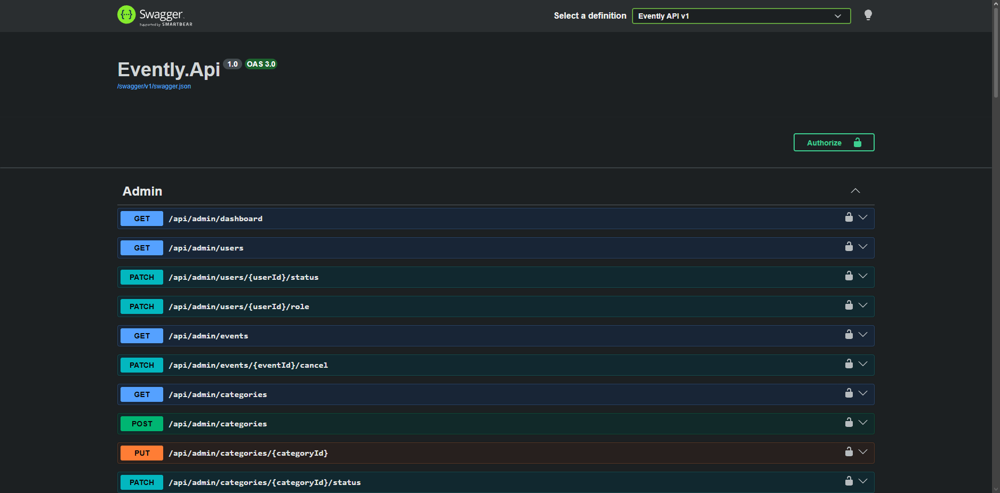

# 🔌 Evently – API REST

API REST desarrollada para **Evently**, encargada de gestionar la lógica de usuarios, eventos, entradas, reservas, check-in, estadísticas, administración y recuperación de contraseña.

El backend está desarrollado con **ASP.NET Core**, utiliza **Entity Framework Core + SQL Server** y se encuentra publicado en **Microsoft Azure**.

## 🚀 API

🔗 **API publicada:**  
[Evently API](https://evently-api-ere0f4csdudkcvfe.centralus-01.azurewebsites.net)

🔗 **Swagger:**  
[Explorar endpoints](https://evently-api-ere0f4csdudkcvfe.centralus-01.azurewebsites.net/swagger)

## 📸 Vista de la API

## ✨ Funcionalidades

- 🔐 Registro e inicio de sesión mediante JWT.
- 🔑 Recuperación de contraseña mediante correo electrónico.
- 📧 Envío de correos transaccionales con Brevo.
- 👥 Roles de **User, Organizer y Admin**.
- 📅 Creación, edición, publicación y cancelación de eventos.
- 🖼️ Carga y almacenamiento de imágenes de eventos.
- 🎫 Reserva y cancelación de entradas.
- 🔢 Control de capacidad y disponibilidad.
- 📱 Código único para cada ticket.
- ✅ Check-in de asistentes.
- 🚫 Prevención de doble check-in.
- 👥 Consulta de asistentes por evento.
- 📊 Estadísticas de reservas, ocupación y asistencia.
- 🛡️ Administración de usuarios, eventos y categorías.
- 🔒 Validación de permisos y propiedad de recursos.

## 📚 Endpoints Principales

- `/api/auth` → Registro, login y recuperación de contraseña.
- `/api/users` → Información y operaciones del usuario.
- `/api/events` → Gestión de eventos e imágenes.
- `/api/tickets` → Reservas, tickets y check-in.
- `/api/organizer` → Estadísticas y asistentes.
- `/api/categories` → Categorías.
- `/api/admin` → Administración general.

## 🔐 Seguridad

- Autenticación mediante JWT.
- Autorización basada en roles.
- Validación del estado y rol del usuario en cada sesión.
- Contraseñas almacenadas mediante hashing.
- Tokens de recuperación temporales y de un solo uso.
- Hash de los tokens de recuperación almacenado en base de datos.
- Validación de propiedad de eventos.
- Prevención de doble check-in.
- Control de capacidad desde el backend.
- API Keys y credenciales almacenadas mediante variables de entorno.
- Restricciones de firewall para el acceso a Azure SQL.

## 📧 Recuperación de Contraseña

Evently utiliza **Brevo Transactional Email API** para enviar enlaces de recuperación.

Los enlaces:

- Tienen una duración limitada.
- Solo pueden utilizarse una vez.
- Utilizan tokens generados de forma aleatoria.
- Solo almacenan el hash del token en la base de datos.

## ☁️ Infraestructura

- **Backend:** Microsoft Azure App Service.
- **Base de datos:** Azure SQL Database.
- **Frontend:** Netlify.
- **Correos:** Brevo Transactional Email API.

La base de datos utiliza el nivel gratuito de **Azure SQL Serverless** con pausa automática al alcanzar los límites gratuitos configurados.

## 🛠️ Tecnologías

- ASP.NET Core
- Entity Framework Core
- SQL Server
- JWT Authentication
- Swagger / OpenAPI
- Brevo Transactional Email API
- LINQ

## 🌐 Frontend

🔗 **Aplicación:**  
[https://eventlyfront.netlify.app](https://eventlyfront.netlify.app)

---

© 2026 Evently. Todos los derechos reservados.

Hecho con ❤️ por **Adhoper**.
